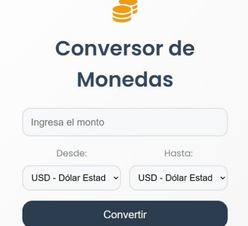
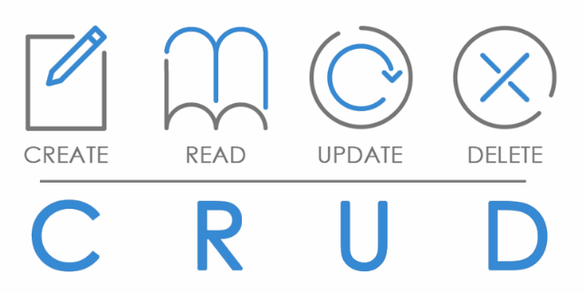

# 🎓 Portafolio de Alex Álvarez Solis  

---

## 👤 Perfil  
  

**📌 Nombre:** Alex Álvarez Solis  
**🎓 Universidad:** Universidad Continental  
**📚 Curso:** Construcción de Software  
**📂 Grupo:** 1  
**🔗 GitHub:** [AlvarezDev](https://github.com/AlvarezDev)  

---

## 🚀 Proyectos  

### 🔹 **1. Calculadora Básica (Python)**  
📌 Calculadora que realiza operaciones matemáticas básicas.  
  

---

### 🔹 **2. Gestor de Tareas (C#)**  
📌 Aplicación para organizar tareas y marcar completadas.  
  

---

### 🔹 **3. Conversor de Monedas (Python)**  
📌 Convierte valores entre distintas monedas en tiempo real.  
  

---

### 🔹 **4. Adivina el Número (C#)**  
📌 Juego en el que el usuario intenta adivinar un número aleatorio.  
  

---

### 🔹 **5. CRUD de Contactos (Python - SQLite)**  
📌 Sistema para gestionar contactos usando una base de datos SQLite.  
  

---

### 🔹 **6. Generador de Contraseñas (C#)**  
📌 Crea contraseñas seguras con combinaciones aleatorias.  
  

---

## 📞 Contacto  
✉ **Email:** alex.alvarez98547@gmail.com  
🌐 **Portafolio Grupal:** [Grupo 1](https://grupo01.github.io)  
